# Git Flow 

[Git Flow](assets/Git-branching-model.pdf)

### 分支應用情境
根據 Git Flow 的建議，主要的分支有 master、develop、hotfix、release 以及 feature 這五種分支，各種分支負責不同的功能。

其中 Master 以及 Develop 這兩個分支又被稱做長期分支，因為他們會一直存活在整個 Git Flow 裡，而其它的分支大多會因任務結束而被刪除。

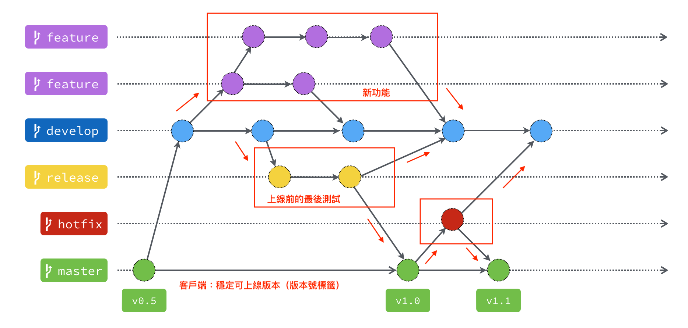

#### Master 分支

        主要是用來放穩定、隨時可上線的版本。
        這個分支的來源只能從別的分支合併過來，開發者不會直接 Commit 到這個分支。
        因為是穩定版本，所以通常也會在這個分支上的 Commit 上打上版本號標籤。

#### Develop 分支

        這個分支主要是所有開發的基礎分支，當要新增功能的時候，所有的 Feature 分支都是從這個分支切出去的。
        而 Feature 分支的功能完成後，也都會合併回來這個分支。

#### Hotfix 分支

    當線上產品發生緊急問題的時候，會從 Master 分支開一個 Hotfix 分支出來進行修復

    Hotfix 分支修復完成之後，會合併回 Master 分支，也同時會合併一份到 Develop 分支。

##### 為什麼要合併回 Develop 分支？
    如果不這麼做，等到時候 Develop 分支完成並且合併回 Master 分支的時候，那個問題就又再次出現了。
    
##### 那為什麼一開始不從 Develop 分支切出來修？
    因為 Develop 分支的功能可能尚在開發中，這時候硬是要從這裡切出去修再合併回 Master 分支，只會造成更大的災難。

#### Release 分支

    當認為 Develop 分支夠成熟了，就可以把 Develop 分支合併到 Release 分支，在這邊進行算是上線前的最後測試。
    測試完成後，Release 分支將會同時合併到 Master 以及 Develop 這兩個分支上。
    
    Master 分支是上線版本，而合併回 Develop 分支的目的，是因為可能在 Release 分支上還會測到並修正一些問題，
    所以需要跟 Develop 分支同步，免得之後的版本又再度出現同樣的問題。

#### Feature 分支

    當要開始新增功能的時候，就是使用 Feature 分支的時候了。
    Feature 分支都是從 Develop 分支來的，完成之後會再併回 Develop 分支。

### 使用 Git Flow

1. Git Flow 初始化
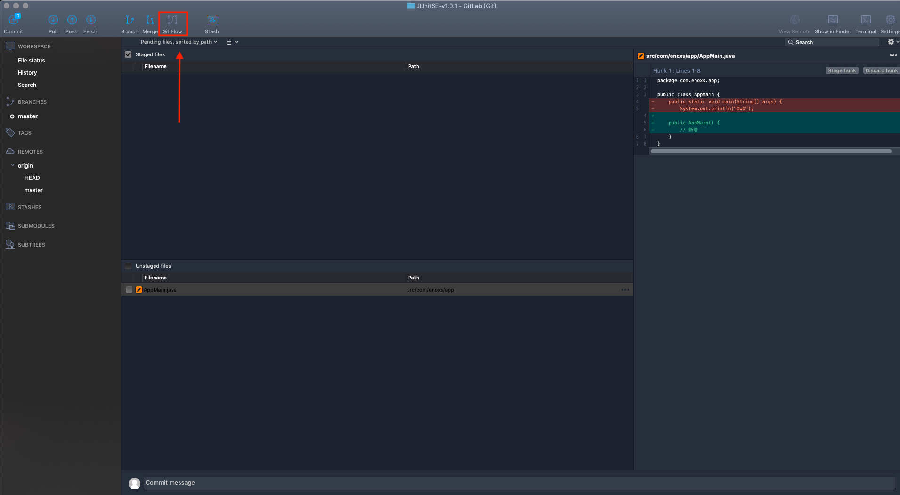
2. 設定分支         
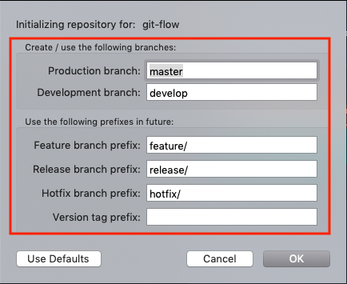

        無特別需求，使用預設值
#### Git Flow 初始化成功後，會出現 develop 長期分支
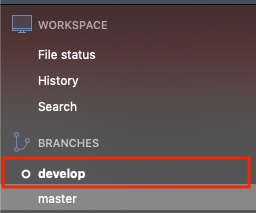
###### Git Flow 初始化時，工作區必須清空，否則會出現下方錯誤
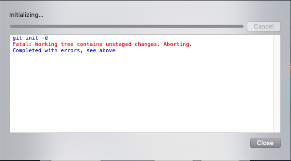
3. 根據任務開始開發
#### 在點擊一次 「Git Flow」按鈕
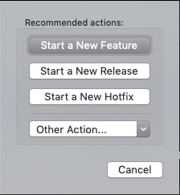
#### 範例：新增 MyBatisUtil 功能
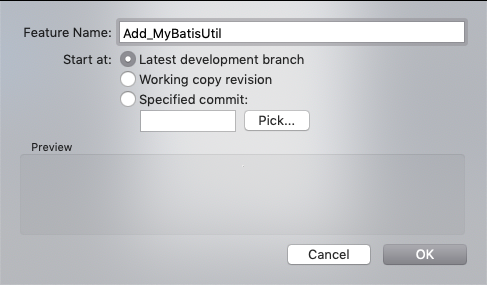
##### Feature 分支
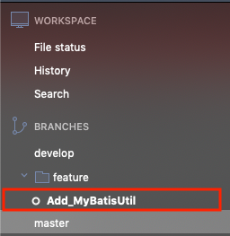
#### 開發
        開發 x N Day
#### 完成功能
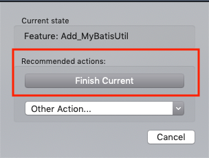
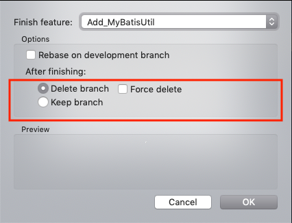
4. 分支狀態
#### feature : keep branch
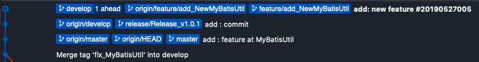
#### release : keep branch
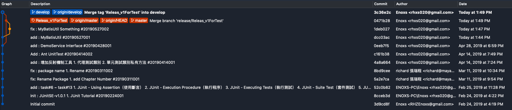

        從 develop 分支開始，完成功能時會自動合併回 develop 與 master。
        Master 分支會以 Releas 分支名稱打上標籤（TAG）
#### hotfix : keep branch
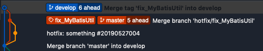

        從 master 分支開始，完成功能時會自動合併回 develop 與 master
        Master 分支會以 Hotfix 分支名稱打上標籤（TAG）
5. 合併過的分支要不要留著？
#### 分支
        標籤，40 個字元的檔案，標記出它目前指向哪一個 Commit。
        刪除分支就跟撕掉貼紙一樣，實際上提交的檔案並不會因此消失。
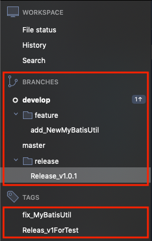
        建議刪除：資訊太多，造成注意力匱乏
**資料來源**<https://gitbook.tw/chapters/branch/about-merged-branch.html>

**資料來源**<https://gitbook.tw/chapters/gitflow/using-git-flow.html>