# Git 開發流程 v1

<!---->

### 環境
+ Git 倉庫： [GitLab]()
+ Git 工具： [SourceTree](https://www.sourcetreeapp.com/)

### 專案開發

1.  登入 GitLab (<>)
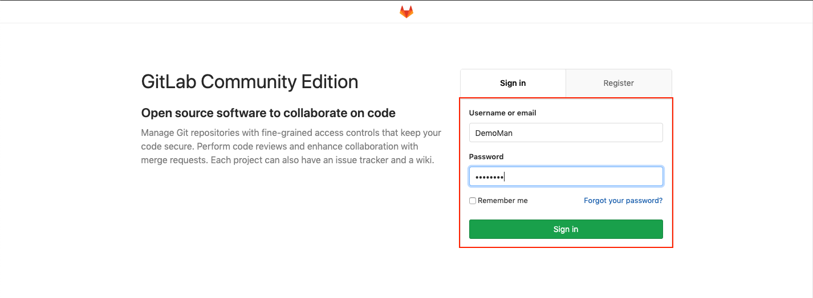
> 測試帳號：
> + Account : DemoMan
> + Password : 00000000

        帳號可由登入頁面註冊或經由站台管理員直接設定

2. 選取已加入專案
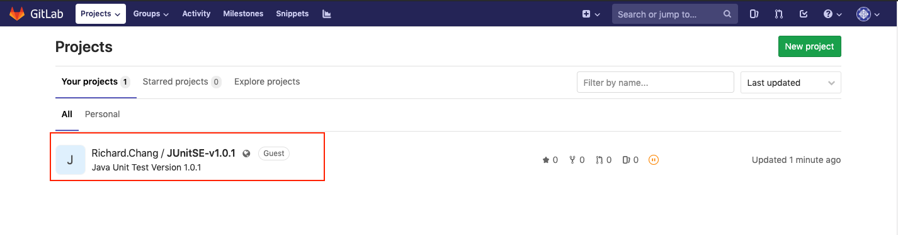

        專案由建案人或站台管理員分配

3. 複製 Git Project 路徑   
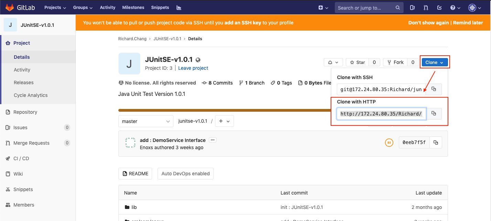

4. 開啟 SourceTree，New -> Clone From URL
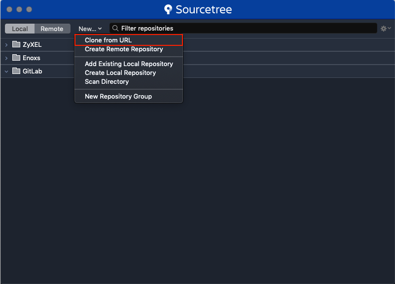

5. 貼上 Git Project 路徑   
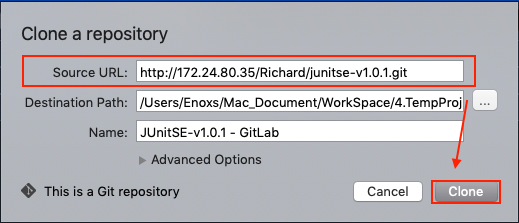

6. 專案建置成功後，顯示版本控制歷史資訊
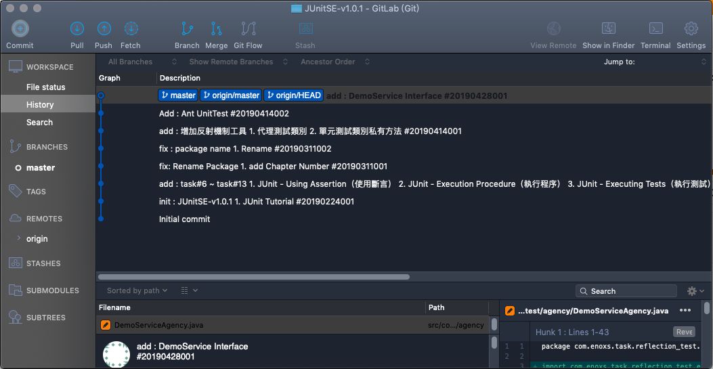

7. 集成開發環境(IDE)，導入
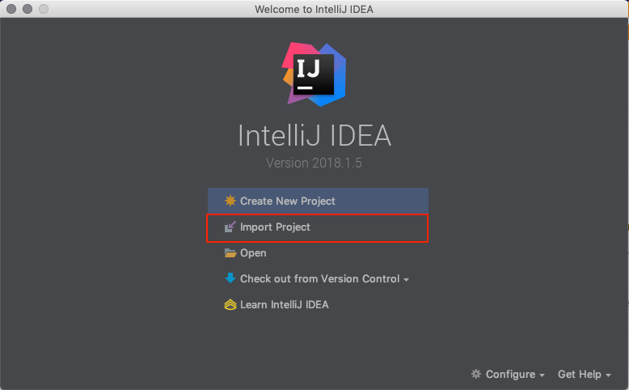
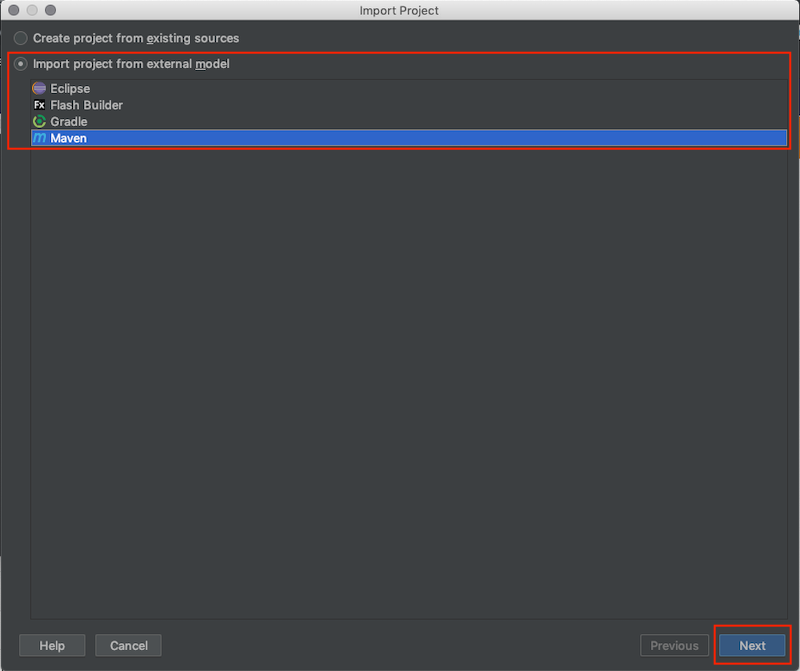

8. 程式開發

9. 程式碼版本控制訊息
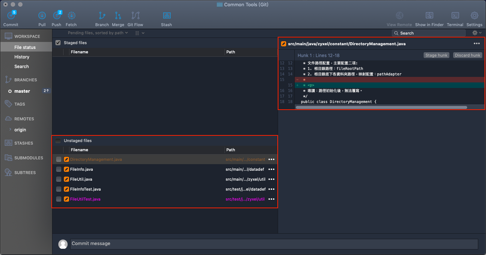
> + 左邊方框：修改過的程式碼
> + 右邊方框：程式碼異動比較

10. 程式碼提交
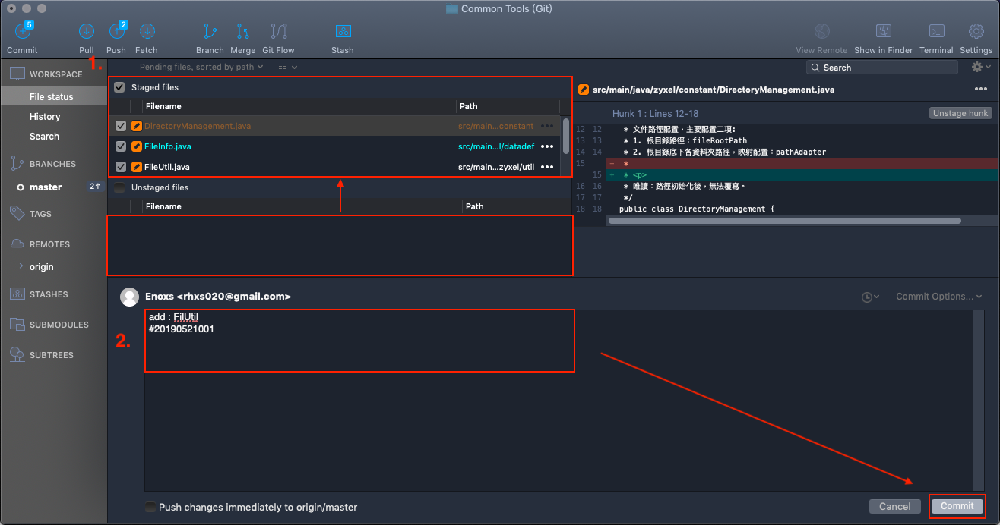
        此頁面的功能操作將會有另一份文件說明：
            
            1. 切換版本
            2. 比對程式碼
            3. 修訂上一次 Commit 
            4. 單支程式碼的提交紀錄
            5. 緩存區的使用
            6. Git Flow 使用
            7. Merge 程式碼

11. 程式碼推送
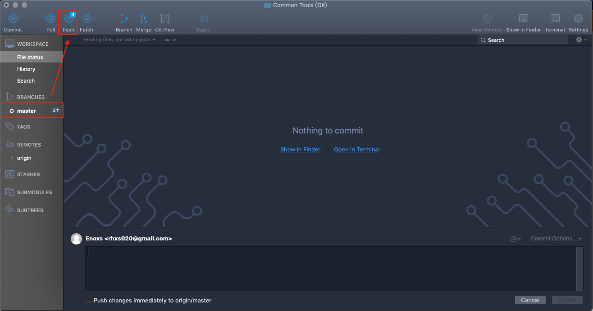
        每個階段性任務完成後都可先提交到本地端
        待要同步遠端版控倉庫時，在一並推送。
推送遠端倉庫設定        
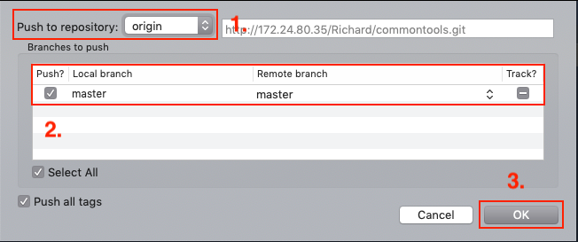

        1. 遠端倉庫
        2. 分支選擇
        3. 確認
> 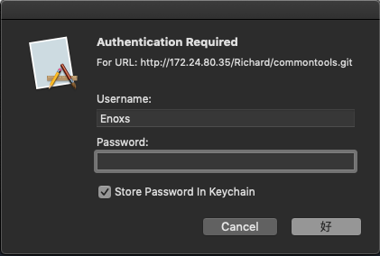
    
        初次推送分支，帳號權限驗證
        
        推送時若發生推送失敗或無法推送等情況，大部分情況都與權限設定有關
        
        Gitlab用戶在組中有五種權限：Guest、Reporter、Developer、Master、Owner

        Guest：可以創建issue、發表評論，不能讀寫版本庫
        Reporter：可以克隆代碼，不能提交，QA、PM可以賦予這個權限
        Developer：可以克隆代碼、開發、提交、push，RD可以賦予這個權限
        Master：可以創建項目、添加tag、保護分支、添加項目成員、編輯項目，核心RD負責人可以賦予這個權限
        Owner：可以設置項目訪問權限- Visibility Level、刪除項目、遷移項目、管理組成員，開發組leader可以賦予這個權限
        
        Gitlab中的組和項目有三種訪問權限：Private、Internal、Public

        Private：只有組成員才能看到
        Internal：只要登錄的用戶就能看到
        Public：所有人都能看到
        

12. Git 推送成功後，GitLab 畫面顯示
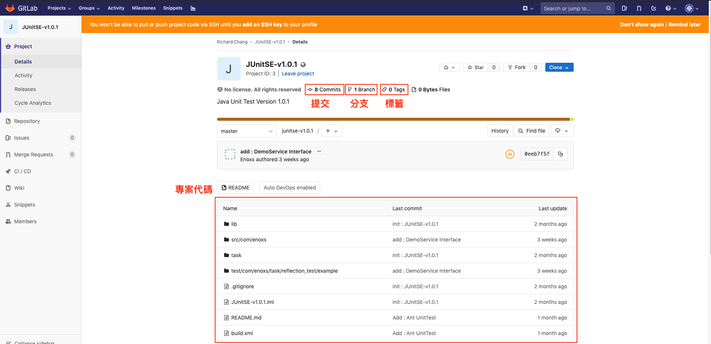
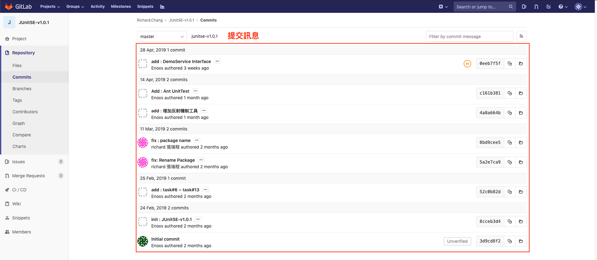

