# Git 開發流程 v2

<!---->
### 目錄
#### Sourcetree 基本操作功能
+ 程式碼比對
+ 暫存功能（Git Stash）
+ 修改已提交紀錄
+ 歷史資料列表
+ 查找檔案提交歷史紀錄

### 前言

##### 延續 **Git 開發流程 v1，說明提交程式碼時常用到的功能操作** 
    程式碼完成開發後，版本提交三階段：
1. Add
2. Commit
3. Push

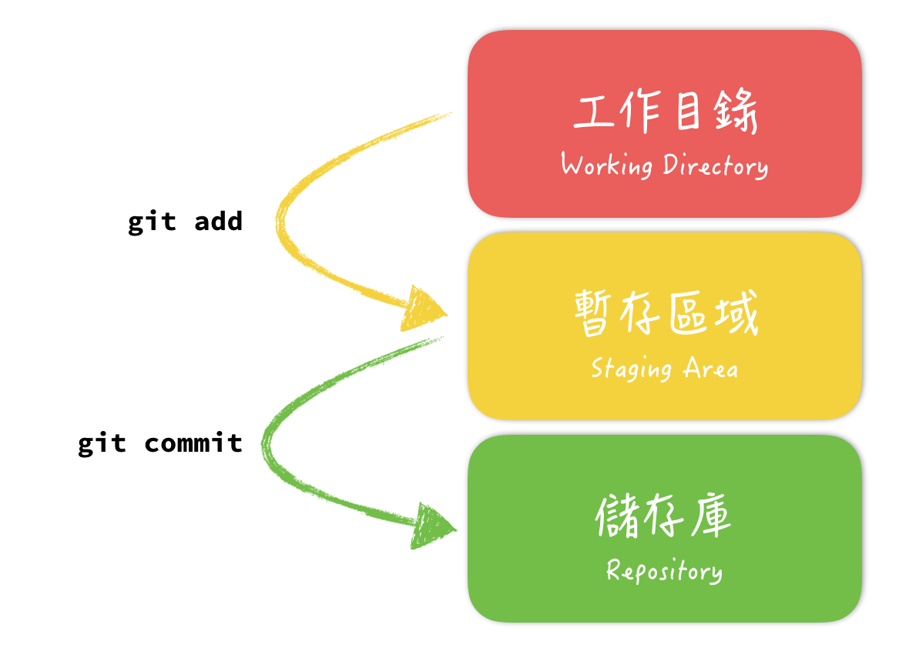

來源：<https://gitbook.tw/chapters/using-git/working-staging-and-repository.html>

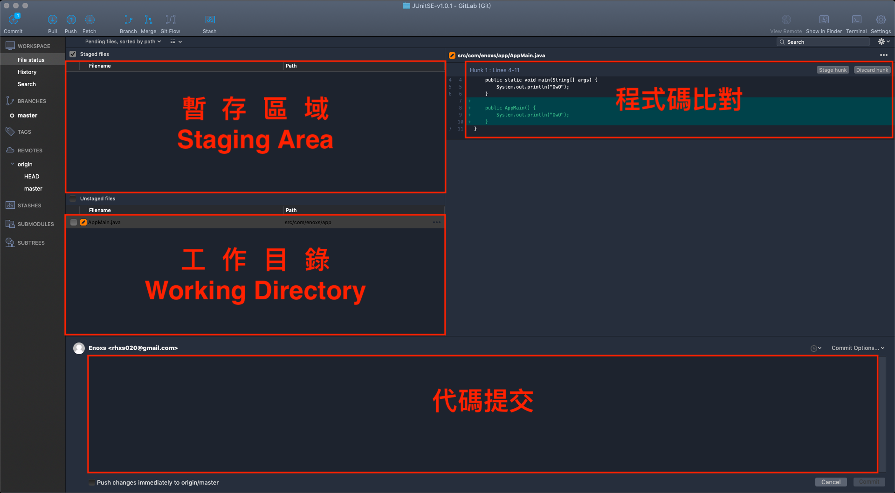
    
### 程式碼比對

#### 原程式碼
``` java
public class AppMain {
    public static void main(String[] args) {
        System.out.println("OwO");
    }
}
```
#### 改動後
``` java
public class AppMain {
    
    public AppMain() {
        // 新增
    }
}
```
#### 顏色區塊與按鈕功能
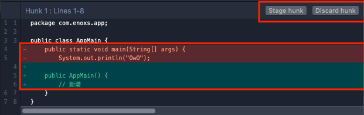
+ 紅色區塊：本次修改後被刪除的
+ 綠色區塊：本次修改後被新增的
+ 按鈕 Stage hunk : 將這隻改動過的程式碼放入到「暫存區」
+ 按鈕 Discard hunk : 取消這次改動，還原到上次提交的狀態

#### 選取區塊，單行調整
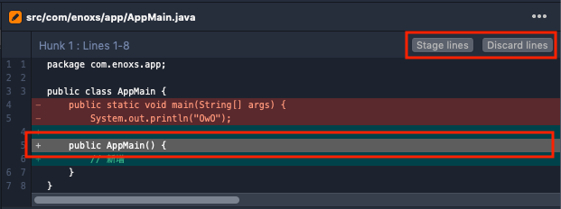
+ 反灰區塊：選取調整範圍
+ 按鈕 Stage lines : 將這隻改動過的「單行」程式碼放入到「暫存區」
+ 按鈕 Discard lines : 取消「單行」改動，還原到上次提交的狀態

### 暫存功能（Git Stash）

+ 狀況1：手中的工作做到一半，臨時要切換到別的任務
+ 狀況2：要打包版本，有正式機、測試機、還有本地端的開發環境

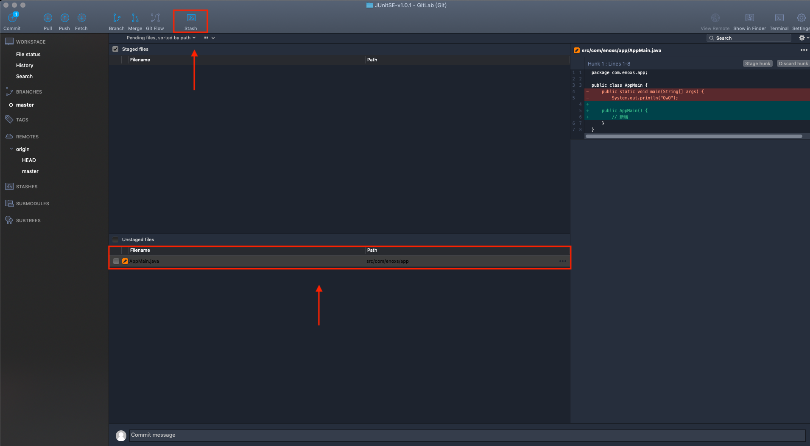

        將工作區的代碼更動先暫存起來

#### Stash Button (放大)
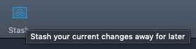
#### Stash Message
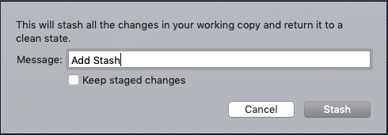
#### Stash List
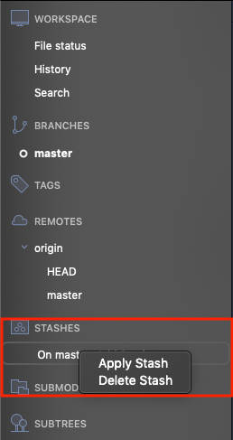
+ Apply Stash : 回復暫存
+ Delete Stash ： 刪除暫存

### 修改已提交紀錄

+ 狀況1：Commit 訊息覺得不夠完整，修改訊息
+ 狀況2：Commit 檔案發現有遺漏，追加檔案

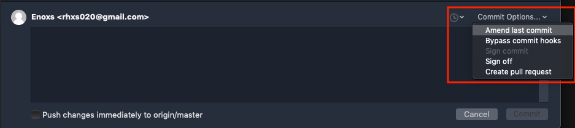

        Working Directory > Stashing Area > Commit Options > Amend last commit 
        
### 歷史資料列表


+ origin/HEAD 、 origin/master 、 origin/develop : 遠端倉庫的分支
+ HEAD 、 master 、 develop : 本地端的分支
+ fix_MyBatisUtil 、 Release_v1ForTest : 標籤

        HEAD 標註目前查看哪一個版本的標籤
        正常情况下，HEAD 會指向某一個分支，而分支會指向某一個 Commit，在此種情況下才能正常提交
        
#### 右鍵功能
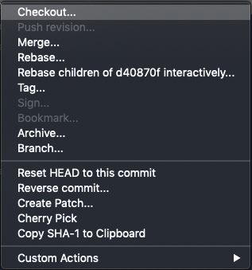

+ Checkout : 查看版本
+ Merge: 合併分支

### 查找檔案提交歷史紀錄

+ ~~狀況：抓戰犯，Bug 作者~~

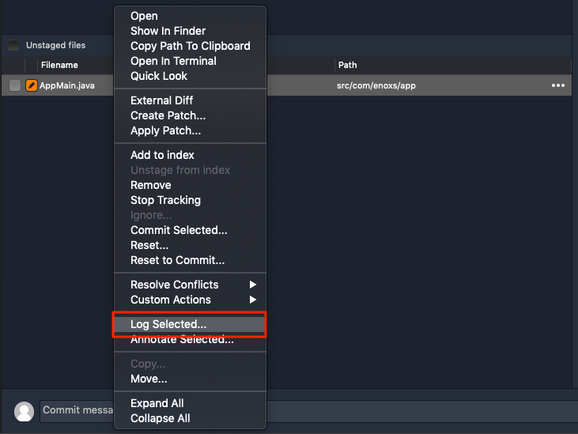

        檔案 > 右鍵 > Log Selected
        
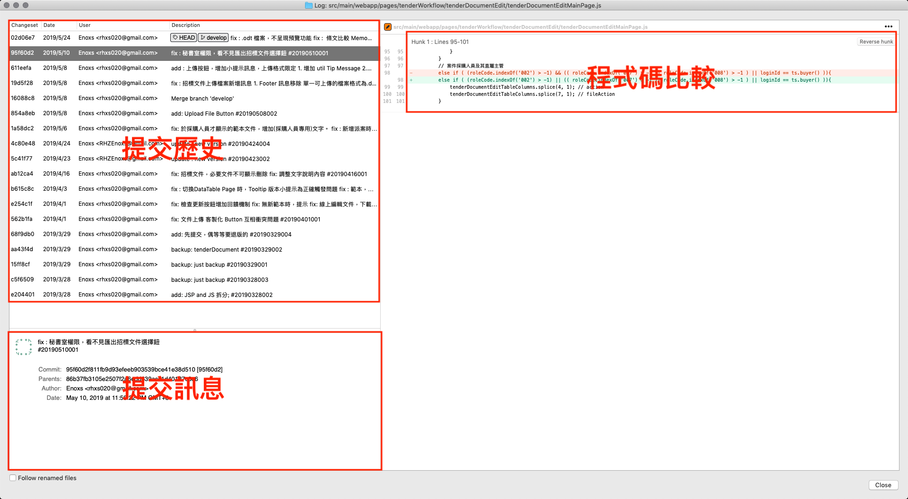


