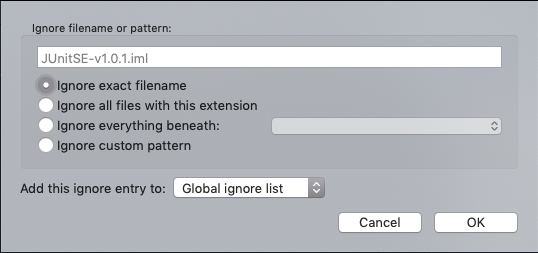
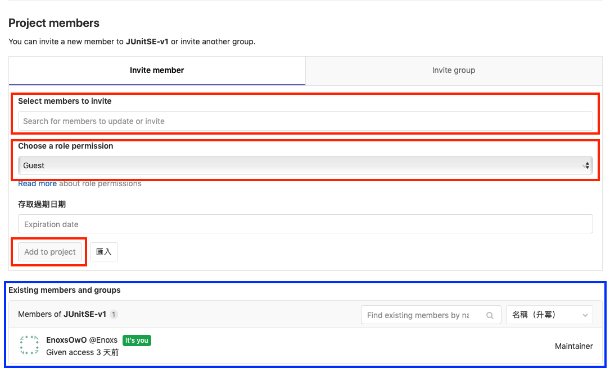

# GitLab 上建置新專案

## 創建新專案

1. GitLab 上建立 Project
登入 GitLab 入口畫面

> 空專案情況下，點選紅框處 Create a Project 按鈕
>

> 已有專案情況下，點選紅框處 New Project 按鈕
2. 輸入專案詳細訊息

> Visibility Level : 選擇 Public
>
> Initialize repository with a README : 是否創建 README.md 文件
>       此一選項會影響到後續代碼的提交推送方式
>
創建專案時選擇創建 README 文件的情況下

> 後續操作方式即可參照[Git Sop v1](http://172.24.80.35/Richard/document/blob/master/Git%20%E7%89%88%E6%9C%AC%E6%8E%A7%E5%88%B6/Git%20Sop%20v1.md) 文件
>
> 先 Clone 專案下來，提交完後再推送專案上去
>
創建專案時不創建 README 文件的情況下

> 先在本地端先建置本地端資料庫，提交完後再推送專案
>
3. 使用 SourceTree 將專案加入到本地端的版本控制庫
 
> New > Add Existing Local Respository
>
  
> 選擇專案目錄  
>
   
>
> 預設值不更動
>
   
> 創建成功

4. 設定忽略版本控制檔案（.gitignore）
  
> 選取不提交到版本控制的檔案
>
  
>
> 右鍵 > ignore
>
   
>
> 設定忽略規則：參照 [SVN 移轉 Git 版控](GitLab-SVN_To_Git.md)
5. 提交檔案到本地端資料庫
  
6. 遠端資料庫設定
  
 
> 對話視窗 > Remotes > Add
> 
 
> 設定剛才建立的專案路徑
>
 
> 完成遠端設定
>
7. 推送已提交版本
 
> 
 
> 選擇剛才建立的遠端資料庫，選擇推送的分支
>
 
> 初次推送 Git 帳號驗證
>
8. 刷新瀏覽器，專案建立成功
 
9. 設定專案參與成員

> 點選左側「導覽列」> 設定 > 成員
>

>

> member's account
>

> member's permission
> + Guest
> + Reporter
> + Developer
> + Maintainer

10. 成員設定完成

> 參與專案成員專案面板可見專案項目
