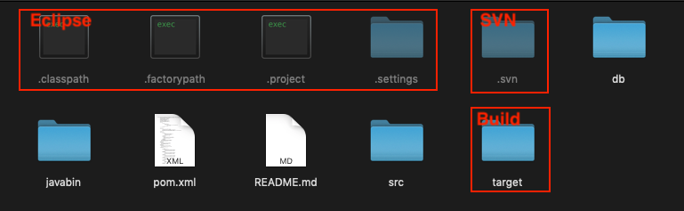
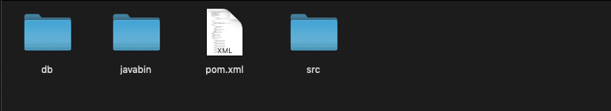
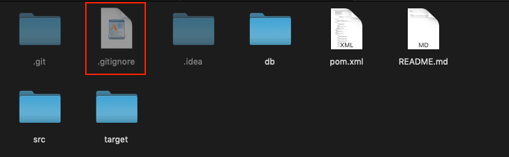
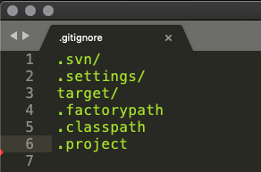
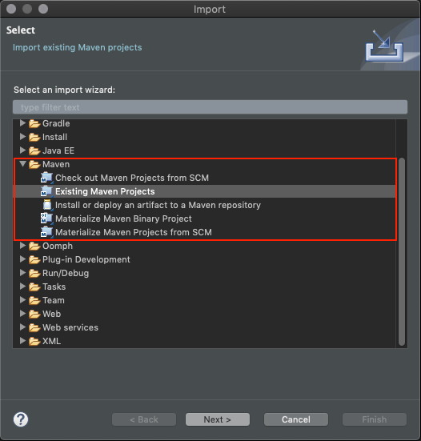
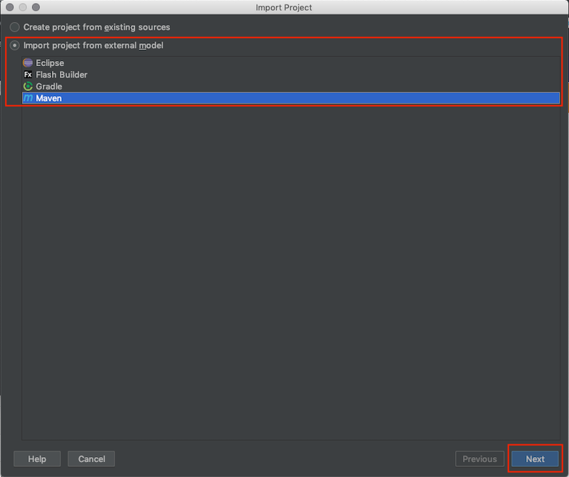

# SVN 移轉 Git

#### 專案目錄     
 
> 紅框處是不需要加入到版本控制的檔案
>
> 建議刪除或加入到 ignore 清單中
>
 
> 以單純的 Maven 專案結構提交到版控

設定過 ignore 清單，專案目錄下會產生 .gitignore 檔

  
  

> 設定此檔案可預先避免後續參與專案人員不小心提交非必要版控檔案

後續參與專案人員皆以 Import Maven Project 的方式，加入到集成開發環境中

##### Eclipse
  
 
##### IntelliJ 
 
