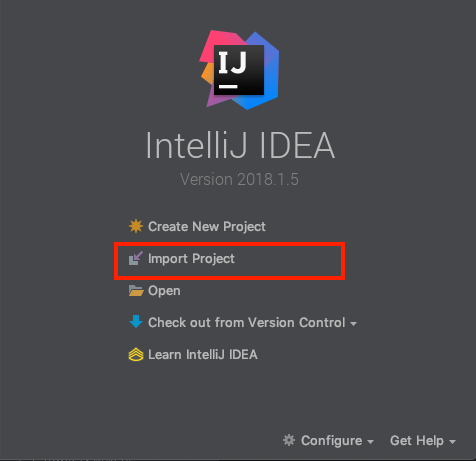
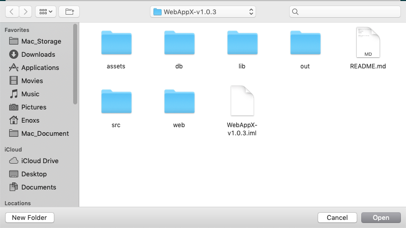
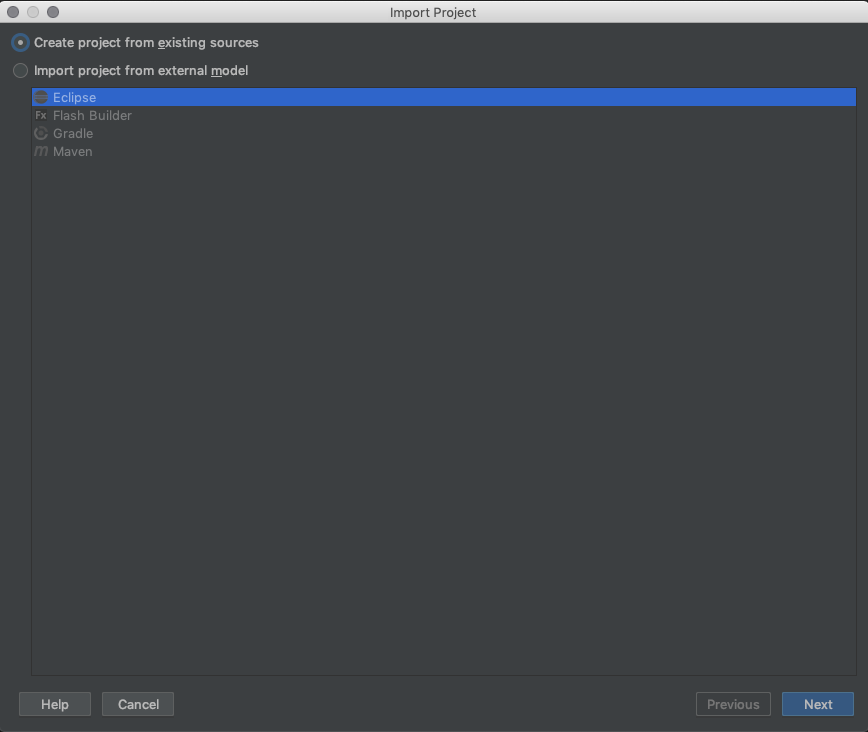
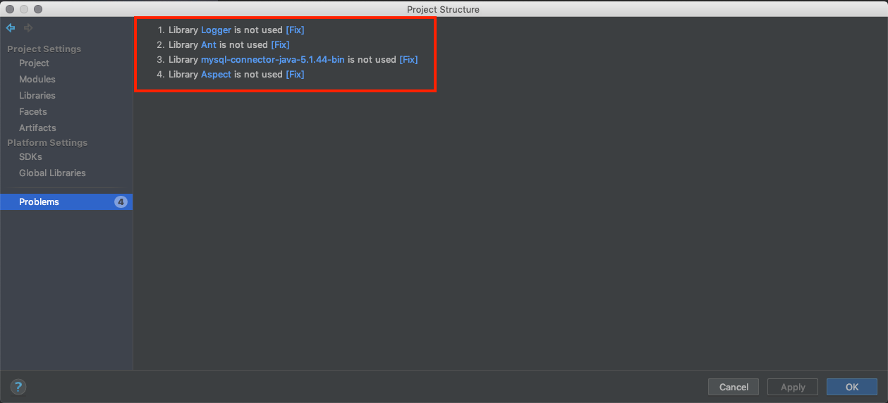
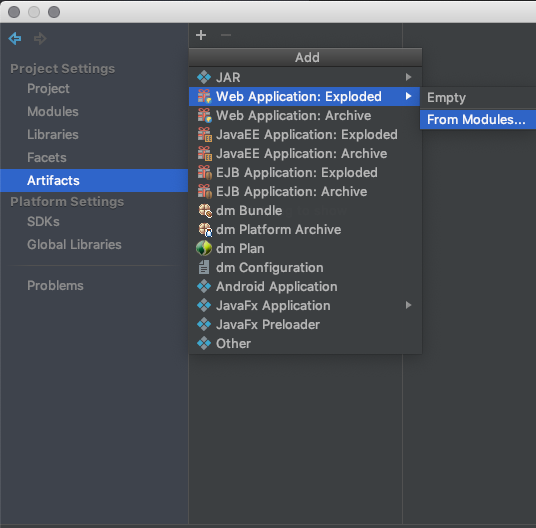
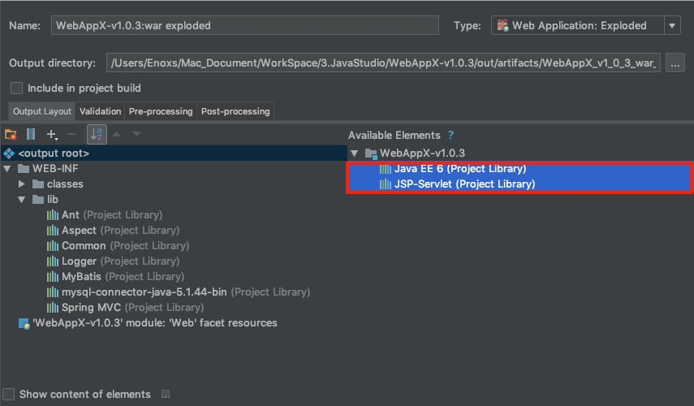
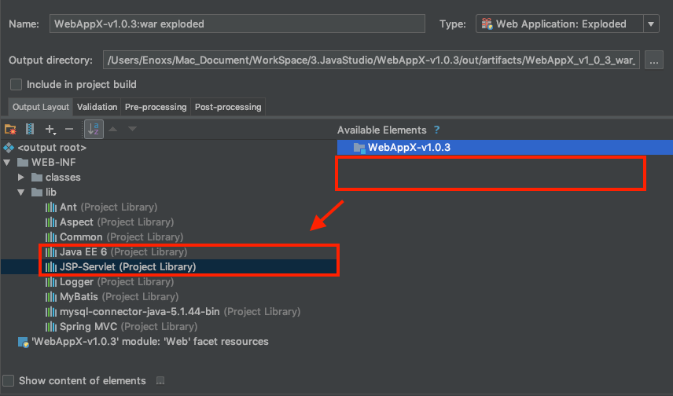
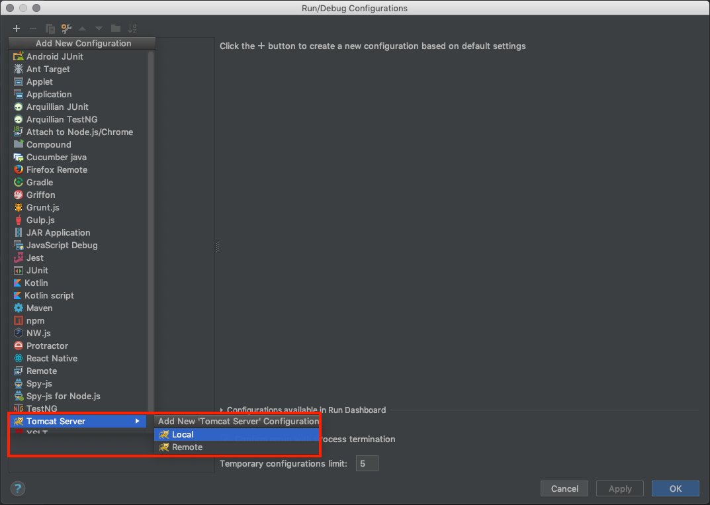
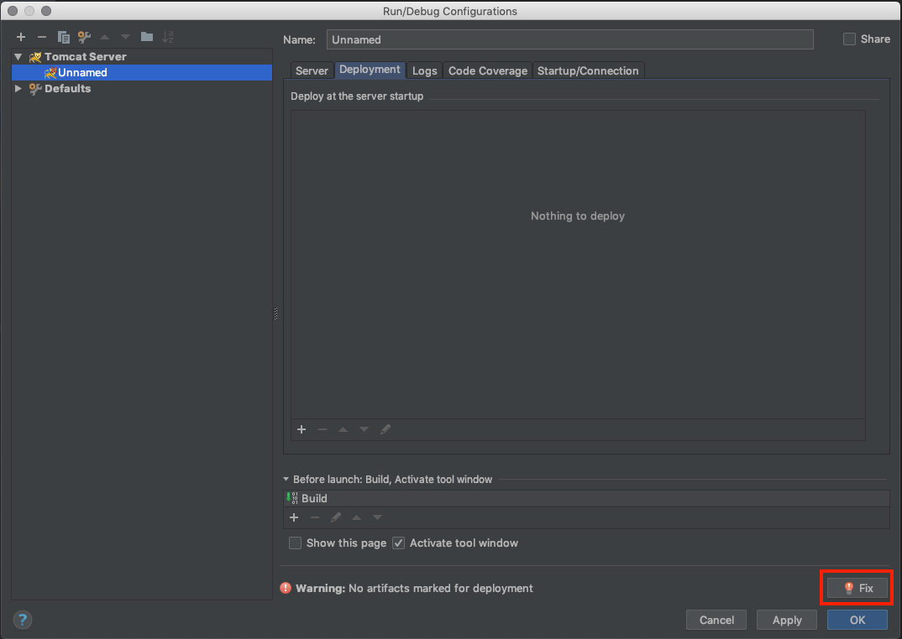
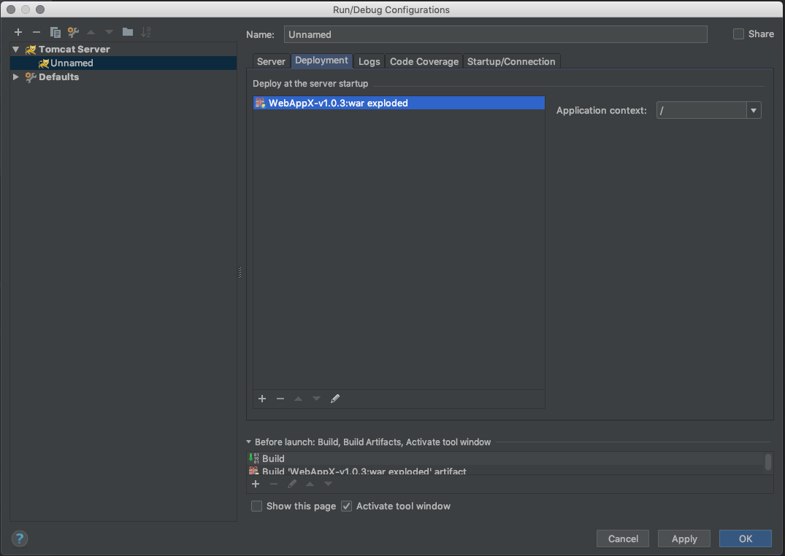

# IntelliJ Import Spring MVC Project

##### Import Project

##### Select Source Fold 

##### Next > Next > Next ... > Finish

##### Open Project Structure > Problems > Fix All

##### Open Project Structure > Artifacts > Add Web Application : Exploded > From Modules ...

##### Move Library (original)

##### Move Library (after)

##### Edit Configurations > Add New Configuration > Tomcat

##### Deployment > Fix

##### Finish

